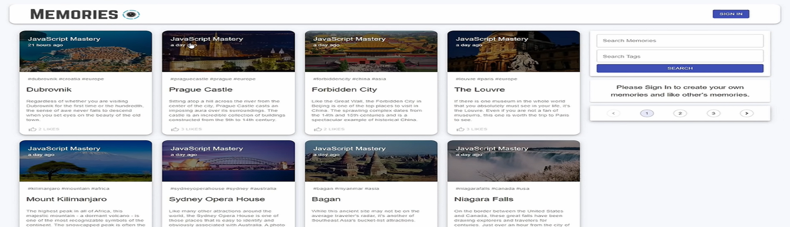

   
    
   
  

    
    
    
    
  

  <h3 align="center">A Memories Application</h3>

   

     Build this project step by step with our detailed tutorial on <a href="https://youtu.be/KzpOabCuqrM" target="_blank"><b>JavaScript Tutorial</b></a> YouTube. Join the JST family!
    

